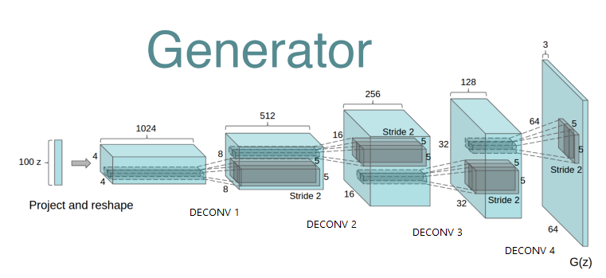
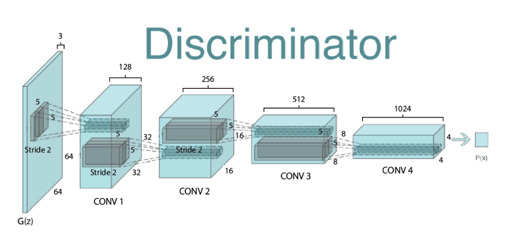
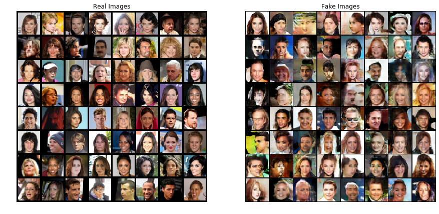
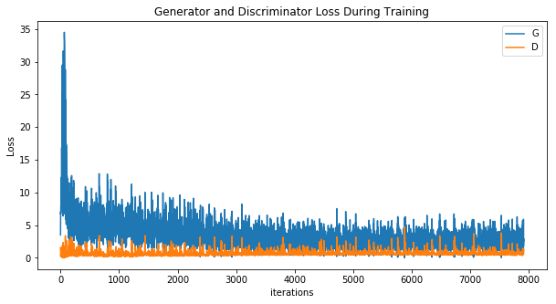

# Deep Convolutional GAN in PyTorch

This repository contains code of DCGAN which is tested and trained on Celebebraty Face datasets. It is based on PyTorch.

## What is a DCGAN?

GANs are a framework for teaching a DL model to capture the training data’s distribution so we can generate new data from that same distribution. GANs were invented by Ian Goodfellow in 2014 and first described in the paper Generative Adversarial Nets. They are made of two distinct models, a generator and a discriminator. The job of the generator is to spawn ‘fake’ images that look like the training images. The job of the discriminator is to look at an image and output whether or not it is a real training image or a fake image from the generator. During training, the generator is constantly trying to outsmart the discriminator by generating better and better fakes, while the discriminator is working to become a better detective and correctly classify the real and fake images. The equilibrium of this game is when the generator is generating perfect fakes that look as if they came directly from the training data, and the discriminator is left to always guess at 50% confidence that the generator output is real or fake.


A DCGAN is a direct extension of the GAN described above, except that it explicitly uses convolutional and convolutional-transpose layers in the discriminator and generator, respectively. It was first described by Radford et. al. in the paper [Unsupervised Representation Learning With Deep Convolutional Generative Adversarial Networks](https://arxiv.org/pdf/1511.06434.pdf). The discriminator is made up of strided convolution layers, batch norm layers, and LeakyReLU activations. The input is a 3x64x64 input image and the output is a scalar probability that the input is from the real data distribution. The generator is comprised of convolutional-transpose layers, batch norm layers, and ReLU activations. The input is a latent vector, z, that is drawn from a standard normal distribution and the output is a 3x64x64 RGB image. The strided conv-transpose layers allow the latent vector to be transformed into a volume with the same shape as an image. In the paper, the authors also give some tips about how to setup the optimizers, how to calculate the loss functions, and how to initialize the model weights.


## Contents
- [Deep Convolutional GAN in PyTorch](#Deep-Convolutional-GAN-in-PyTorch)
  - [What is a DCGAN?](#What-is-a-DCGAN)
  - [Contents](#Contents)
  - [1. Setup Instructions and Dependencies](#1-Setup-Instructions-and-Dependencies)
  - [2. Dataset](#2-Dataset)
  - [3. Parameters](#3-Parameters)
  - [4. Training the model](#4-Training-the-model)
  - [5. Model Architecture](#5-Model-Architecture)
    - [Generator Modal](#Generator-Modal)
    - [Discriminator Model](#Discriminator-Model)
  - [6. Observations](#6-Observations)
    - [Real and Fake images](#Real-and-Fake-images)
    - [Loss with time](#Loss-with-time)
  - [7. Repository overview](#7-Repository-overview)
  - [8. Extras](#8-Extras)


## 1. Setup Instructions and Dependencies

Clone the repositiory on your local machine.

``` Batchfile
git clone https://github.com/ishanrai05/DCGANs.git
```

Start a virtual environment using python3
``` Batchfile
virtualenv env
```


Install the dependencies
``` Batchfile
pip install -r requirements.txt
```

You can also use google collab notebook. In that case just upload the notebook provided in the repository and you are good to go.


## 2. Dataset

I have used [Celeb-A faces dataset](http://mmlab.ie.cuhk.edu.hk/projects/CelebA.html) which can be downloaded from [here](https://drive.google.com/drive/folders/0B7EVK8r0v71pTUZsaXdaSnZBZzg). It has around 20000 images of celibrities. Once downloaded create a repository named `celeba` in the same folder as `main.py` and extract the contents of `img_align_celeba.zip`.


## 3. Parameters

The parameters can be tuned in the files `parameters.py`

* `image_size` - the spatial size of the images used for training. This implementation defaults to 64x64. If another size is desired, the structures of D and G must be changed.
* `num_channels` - number of color channels in the input images. For color images this is 3
* `num_z` - length of latent vector
* `num_feat_gen` - relates to the depth of feature maps carried through the generator
* `num_feat_disc` - sets the depth of feature maps propagated through the discriminator
* `num_epochs` - number of training epochs to run. Training for longer will probably lead to better results but will also take much longer
* `lr` - learning rate for training. As described in the DCGAN paper, this number should be 0.0002
* `beta1` - beta1 hyperparameter for Adam optimizers. As described in paper, this number should be 0.5

## 4. Training the model

To train the model, run

```Batchfile
python main.py --train=True
```

optional arguments:
  | argument | default | desciption|
  | --- | --- | --- |
  | -h, --help | False | show help message and exit |
  | --use_cuda | False | device to train on. default is CPU |
  | --samples | False | See sample images |
  | --num_epochs | 5 | Number of epochs to train on |
  | --train | True | train the model |


## 5. Model Architecture

### Generator Modal

* comprised of convolutional-transpose layers, batch norm layers, and ReLU activations except the last layer which has Tanh and no batch norm. 
* the input is a latent vector, z, that is drawn from a standard normal distribution
* the output is a 3x64x64 RGB image 
* the strided conv-transpose layers allow the latent vector to be transformed into a volume with the same shape as an image.

### Discriminator Model

* is made up of strided convolution layers, batch norm layers, and LeakyReLU activations. 
* input is a 3x64x64 input image 
* the output is a scalar probability that the input is from the real data distribution.
  

## 6. Observations

The modal takes about 30 mins to train for 5 epochs on Google Collab with Nvidia Titan X GPU, probably because of the large dataset.

### Real and Fake images



### Loss with time



## 7. Repository overview


This repository contains the following files and folders

1. **notebook**: This folder contains the jupyter notebook for DCGANs.

2. **images**: Contains images.

3. `discriminator.py`: code for discriminator model.

4. `generator.py`: code for generator model.

5. `parameters.py`: tunable parametes for the model.

6. `utils.py`: Contains helper functions.

8. `train.py`: function to train models from scratch.

9. `main.py`: contains main code to run the model.

7. `requirements.txt`: Lists dependencies for easy setup in virtual environments.


## 8. Extras

+ [Generative Adversarial Networks — Goodfellow et al. (2014)](https://arxiv.org/abs/1406.2661)
+ [DCGANs — Radford et al. (2015)](https://arxiv.org/abs/1511.06434)
